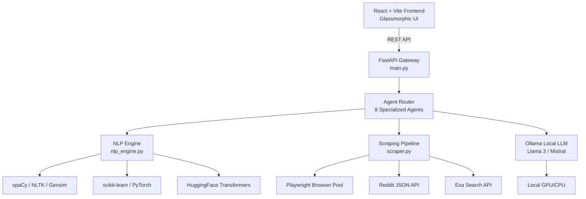

# ⬡ SPECTRA — Market Intelligence & NLP Consultancy Platform

> _Premium AI-powered research consultancy. Palantir meets McKinsey._

---

## Architecture Overview



---

## Project Structure

```
spectra/
├── README.md
├── backend/
│   ├── main.py                  # FastAPI app, CORS, routers
│   ├── nlp_engine.py            # All NLP primitives & techniques
│   ├── scraper.py               # Playwright + Reddit + Exa pipeline
│   ├── requirements.txt
│   ├── .env.example
│   └── agents/
│       ├── __init__.py
│       ├── spectra.py           # Agent 1
│       ├── doc_comparator.py    # Agent 2
│       ├── knowledge_graph.py   # Agent 3
│       ├── review_analysis.py   # Agent 4
│       ├── trend_spotting.py    # Agent 5
│       ├── brand_association.py # Agent 6
│       ├── persona_generator.py # Agent 7
│       └── compliance_checker.py# Agent 8
└── frontend/
    ├── index.html
    ├── package.json
    ├── vite.config.js
    └── src/
        ├── main.jsx
        ├── App.jsx
        ├── index.css
        ├── glass.css
        ├── api/
        │   └── client.js
        └── components/
            ├── ConsultancyDashboard.jsx
            ├── Sidebar.jsx
            ├── Header.jsx
            └── agents/
                ├── Spectra.jsx
                ├── DocComparator.jsx
                ├── KnowledgeGraph.jsx
                ├── ReviewAnalysis.jsx
                ├── TrendSpotting.jsx
                ├── BrandAssociation.jsx
                ├── PersonaGenerator.jsx
                └── ComplianceChecker.jsx
```

---

## NLP Technique → Feature Mapping

| NLP Technique                           | Category       | Agent(s)                                  |
| --------------------------------------- | -------------- | ----------------------------------------- |
| Porter Stemming                         | Preprocessing  | All agents (nlp_engine.stem_tokens)       |
| Inflectional / Derivational Morphology  | Preprocessing  | Doc Comparator, Persona Generator         |
| Sentence Segmentation                   | Preprocessing  | All agents (nlp_engine.segment_sentences) |
| POS Tagging                             | Syntax         | Knowledge Graph, Brand Association        |
| Shallow Parsing (Chunking)              | Syntax         | Spectra, Knowledge Graph          |
| Dependency Parsing                      | Syntax         | Compliance Checker, Knowledge Graph       |
| Bag of Words (BOW)                      | Representation | Review Analysis, Trend Spotting           |
| Vector Space Model (TF-IDF)             | Representation | Doc Comparator, Brand Association         |
| N-gram Language Models                  | Representation | Trend Spotting, Brand Association         |
| Word Embeddings (Word2Vec)              | Representation | Review Analysis, Persona Generator        |
| Sentiment Classification (CNN/ML)       | Advanced       | Review Analysis, Spectra          |
| Named Entity Recognition (CRF/LSTM)     | Advanced       | Spectra, Compliance Checker       |
| Text Summarization (Statistical + DL)   | Advanced       | Doc Comparator, Spectra           |
| Machine Translation (Enc-Dec/Attention) | Advanced       | (Ollama multilingual pipeline)            |
| Question Answering (KB + DL)            | Applications   | Spectra (QA endpoint)             |
| Topic Modeling (LDA)                    | Applications   | Trend Spotting                            |
| Conversational Agent (DL)               | Applications   | All agents (Ollama LLM backbone)          |
| Thematic Roles / Semantics              | Applications   | Brand Association, Persona Generator      |

---

## Setup Instructions

### Prerequisites

- Python 3.10+
- Node.js 18+
- [Ollama](https://ollama.ai) installed locally
- Playwright browsers

### 1. Pull a Local Model via Ollama

```bash
ollama pull llama3
# or for lighter systems:
ollama pull mistral
```

### 2. Backend Setup

```bash
cd backend
python -m venv venv
source venv/bin/activate   # Windows: venv\Scripts\activate
pip install -r requirements.txt

# Download spaCy model
python -m spacy download en_core_web_sm

# Download NLTK data
python -c "import nltk; nltk.download('punkt'); nltk.download('averaged_perceptron_tagger'); nltk.download('stopwords'); nltk.download('wordnet')"

# Install Playwright browsers
playwright install chromium

# Copy env and configure
cp .env.example .env
# Edit .env: set EXA_API_KEY if you have one (optional)

# Start the API
uvicorn main:app --reload --host 0.0.0.0 --port 8000
```

### 3. Frontend Setup

```bash
cd frontend
npm install
npm run dev
# Runs on http://localhost:5173
```

### 4. Environment Variables

```env
OLLAMA_BASE_URL=http://localhost:11434
OLLAMA_MODEL=llama3
EXA_API_KEY=your_exa_key_here   # Optional
REDDIT_CLIENT_ID=                # Optional for higher rate limits
REDDIT_CLIENT_SECRET=            # Optional
```

---

## API Endpoints Reference

| Method | Endpoint                 | Agent                         |
| ------ | ------------------------ | ----------------------------- |
| POST   | `/api/spectra`   | Spectra Agent         |
| POST   | `/api/doc-compare`       | Documentation Comparator      |
| POST   | `/api/knowledge-graph`   | Knowledge Graph Generator     |
| POST   | `/api/review-analysis`   | Product Review Analysis       |
| POST   | `/api/trend-spotting`    | Trend Spotting                |
| POST   | `/api/brand-association` | Brand Association NLP         |
| POST   | `/api/persona-generator` | Persona Generator             |
| POST   | `/api/compliance-check`  | Regulatory Compliance Checker |
| GET    | `/api/health`            | Health check                  |

---

## Technology Stack

| Layer        | Technology                                   |
| ------------ | -------------------------------------------- |
| Frontend     | React 18, Vite 5, Custom CSS (Glassmorphism) |
| Backend      | FastAPI, Uvicorn, Pydantic v2                |
| NLP Core     | spaCy, NLTK, Gensim, scikit-learn, PyTorch   |
| Transformers | HuggingFace `transformers` (local pipelines) |
| LLM          | Ollama (Llama 3 / Mistral — fully local)     |
| Scraping     | Playwright, aiohttp (Reddit JSON)            |
| Search       | Exa API (limited, targeted use)              |
| Embeddings   | Gensim Word2Vec + sentence-transformers      |
